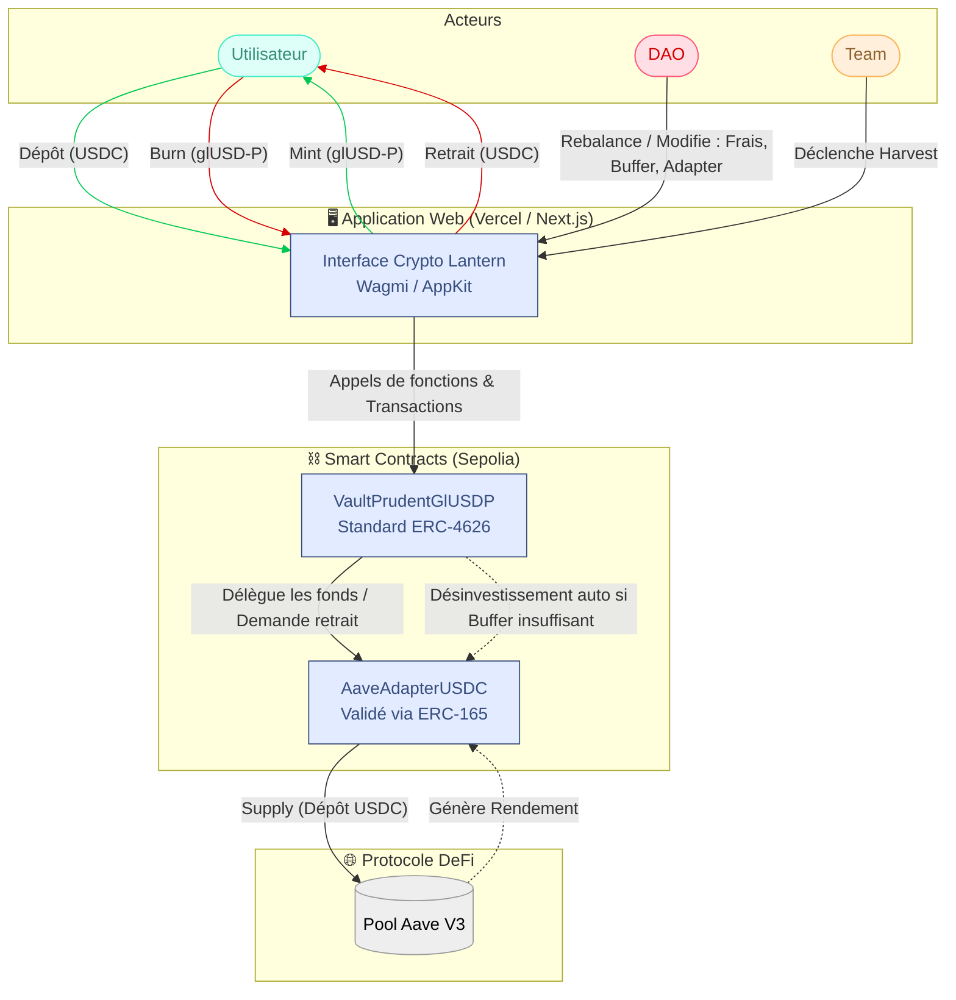

# 🏮 DeFi Lantern

> **DeFi Lantern** est un protocole décentralisé d'agrégation de rendements (Yield Aggregator) pour stablecoins. Un seul dépôt USDC pour une exposition diversifiée aux meilleurs rendements de la DeFi.

## 📖 À propos du projet

Ce projet a été développé dans le cadre d'un projet final de certification Web3.

DeFi Lantern permet aux utilisateurs de déposer leurs stablecoins (USDC) et de laisser le protocole optimiser le rendement. Le projet repose sur des Vaults au standard **ERC4626**. Dans cette version de présentation (Beta/Testnet), le protocole s'appuie sur le profil de risque :

- 🛡️ **Prudent (glUSD-P)** : Sécurité absolue, utilisant exclusivement le protocole Tier-1 **Aave V3**.

_Note : L'architecture est conçue pour être évolutive vers du multi-stratégies (Compound, Morpho, etc.) sur Mainnet, bien que cette itération soit restreinte à un environnement de test (Sepolia)._

## 🏗️ Architecture du Protocole

Le projet illustre la maîtrise des concepts avancés du Web3 :

- **Architecture Modulaire :** Séparation entre le coffre (Vault) et les stratégies (Adapters) pour une évolutivité sans migration de liquidité.
- **Standards ERC :** Implémentation stricte des normes ERC20, ERC4626 (Tokenized Vaults) et ERC165 (Standard Interface Detection).
- **Gestion des Rôles (RBAC) :** Séparation des pouvoirs entre la `Team` (gestion technique, récolte) et la `DAO` (gouvernance, stratégies) avec un système de transfert de propriété sécurisé en deux étapes (Propose/Accept).
- **Traçabilité On-Chain :** Émission d'événements (`Harvest`, `Rebalance`, etc.) pour permettre l'indexation et la construction de tableaux de bord financiers sur le front-end.

## 📂 Structure du Monorepo

Le projet est divisé en deux entités distinctes :

- **Backend** : Smart Contracts Solidity (Vaults ERC4626, Adapters). Propulsé par Hardhat.
- **Frontend** : DApp Web3 Next.js. Tableaux de bord Investisseurs, Administration Team et Gouvernance DAO.

## 🔗 Liens Utiles

- [Site Officiel & DApp](https://www.cryptoluciole.com/)
- [Protocole Vulgarisé](https://www.cryptoluciole.com/protocole-vulgarise.html)
- [Whitepaper](https://www.cryptoluciole.com/#whitepaper)

⚖️ Avertissement
Projet à but académique et expérimental. Les smart contracts n'ont pas été audités par des professionnels.
